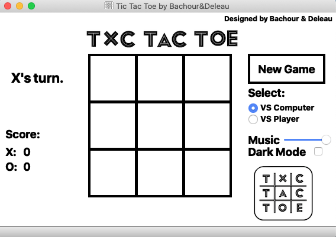
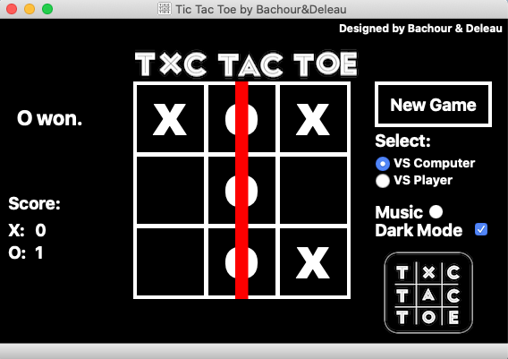

# QT_TicTacToe

QT TicTacToe is the traditional TicTacToe programmed with C++ on QT.

## Installation

Use the following commands in the terminal to install the application on your private computer:

```
git clone https://github.com/PeterBachour/QT_TicTacToe.git
```

## Usage

Once the installation is done you can either double click the file name "TicTacToe" and the application launches automatically.

Or either launch QT and run the application.

Once the game is launched, you can either play against another player or play against an unbeatable AI.

At the right of the grid, you will see the score and who's turn it is.
At the left of the grid, you can start a new game by simply clicking the new game button, change the volume of the music or even play in dark mode.




## Authors
Peter Bachour (peter_bachour@icloud.com)
Nassim Deleau (deleaunassim@gmail.com)
